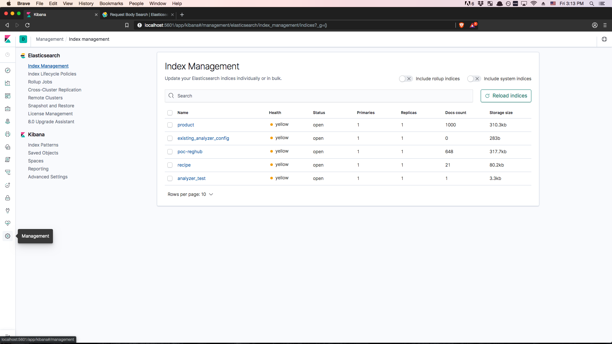
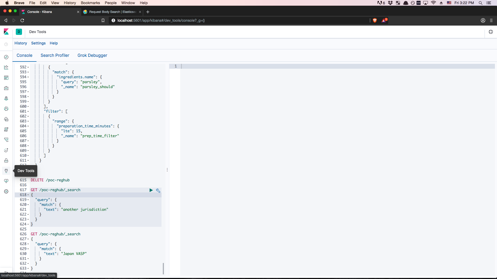

# Config
## Elasticsearch
- [Make sure java is up to dated](https://www.oracle.com/technetwork/java/javase/downloads/index.html)
- [Download](https://www.elastic.co/downloads/elasticsearch) and unzip elasticsearch in your preferred directory
- [Download](https://www.elastic.co/downloads/kibana) and unzip kibana in your preferred directory
## Jupyter notebook
- Make sure you install python
- [Download](https://www.anaconda.com/distribution/) and install Anaoconda for jupyter notebook
- optional: use pipenv to [manage python environment](https://stackoverflow.com/questions/47295871/is-there-a-way-to-use-pipenv-with-jupyter-notebook
)

# Getting Started
To start an elasticsearch server on the local machine, cd to the unzipped elasticsearch directory and run 
```
bin/elasticsearch
```

To use the kibana interface, cd to the unzipped kibana directory and run 
```
bin/kibana
```

Kibana is available at localhost:5601. By default, kibana requires input data to run and has some sample data available. 

Alternatively, you can index your own pdf document. To do so, install anaconda and run the following command in the `poc-reghub` directory:
```
jupyter notebook
```
Jupyter notebook interface will be available at localhost:8888 by default. 

Navigate to `tika.ipynb` and run the file to index a pdf document pulled from the RegHub airtable database. 

You can check whether you've successfully added the document to Elasticsearch via Kibana.


# Writing queries
Elasticsearch has [its own query language](https://www.elastic.co/guide/en/elasticsearch/reference/current/query-dsl.html). Kibana has a dev tool feature that lets you query your search index. 

If you've successfully index a pdf document in `tika.ipynb`, you can try the following queries
```
GET /poc-reghub/_search
{
  "query": {
    "match": {
      "text": "another jurisdiction"
    }
  }
}

GET /poc-reghub/_search
{
  "query": {
    "match": {
      "text": "Japan VASP"
    }
  }
}

```
